# Blueprint: "Chimera" Multi-Archetype Virus

## Overview
The "Chimera" virus is a composite malware that combines the strengths of multiple archetypes from the ICE-Breaker database. It is designed for long-term persistence, stealth, and adaptability in a zero-trust environment.

## Components

### 1. Delivery Mechanism
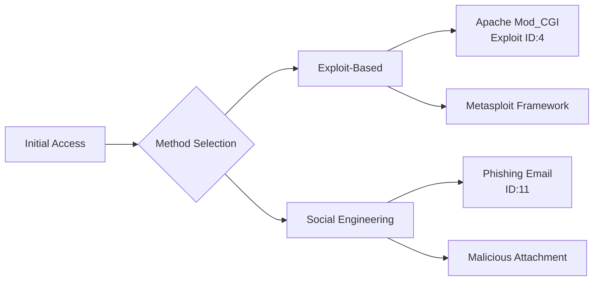

**Exploit:** Use a reliable exploit from the Metasploit framework (like the Apache Mod_CGI exploit in ID 4) to gain initial access.

**Social Engineering:** Alternatively, use a phishing email (ID 11) to deliver the initial payload.

### 2. Persistence
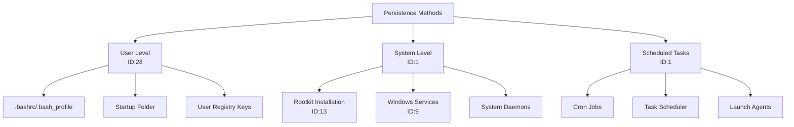

**Multiple Methods:**
- **User-level persistence (ID 28):** Modify user startup files (e.g., .bashrc, Startup folder)
- **System-level persistence (ID 1):** Install a rootkit (ID 13) or a Windows service (ID 9)
- **Scheduled tasks (ID 1):** Use cron jobs or Windows Task Scheduler

### 3. Evasion and Stealth
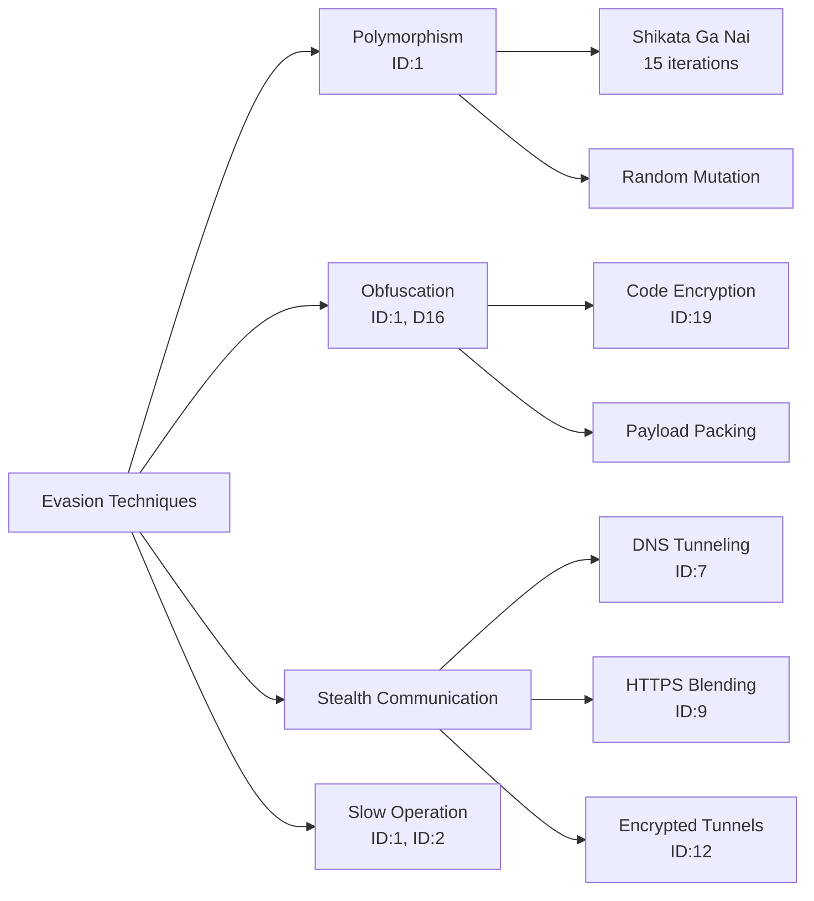

**Polymorphism:** The virus changes its signature continuously (ID 1) using techniques like shikata_ga_nai encoding (15 iterations) and random mutation.

**Obfuscation:** Use advanced obfuscation techniques (ID 1, D16) and encryption (ID 19) to hide the payload.

**Stealthy Communication:**
- Use DNS tunneling (ID 7) for C2, which is difficult to detect
- Use HTTPS (ID 9) or encrypted tunnels (ID 12) to blend with normal traffic

**Slow Operation:** Operate at low speeds (ID 1, ID 2) to avoid triggering rate-based detection.

### 4. Command and Control (C2)
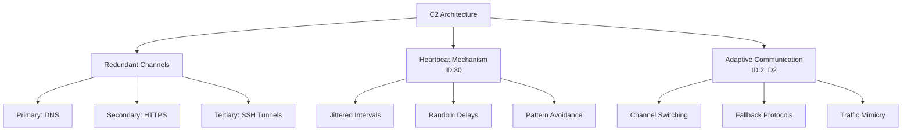

**Redundant Channels:** Use multiple C2 channels (DNS, HTTPS, SSH tunnels) to ensure reliability.

**Heartbeat Mechanism:** Regular check-ins (ID 30) with the C2 server, but with jitter and random delays to avoid pattern detection.

**Adaptive Communication:** If one channel is blocked, switch to another (ID 2, D2).

### 5. Reconnaissance and Lateral Movement
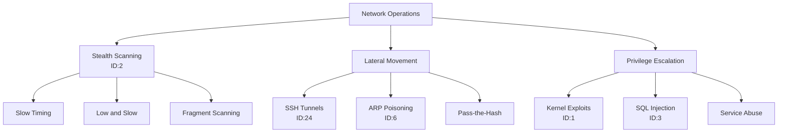

**Stealthy Scanning:** Use slow scanning (ID 2) to map the internal network without triggering alerts.

**Lateral Movement:** Use SSH tunnels (ID 24) and ARP poisoning (ID 6) to move laterally.

**Privilege Escalation:** Use kernel exploits (ID 1) or SQL injection (ID 3) to gain higher privileges.

### 6. Data Exfiltration
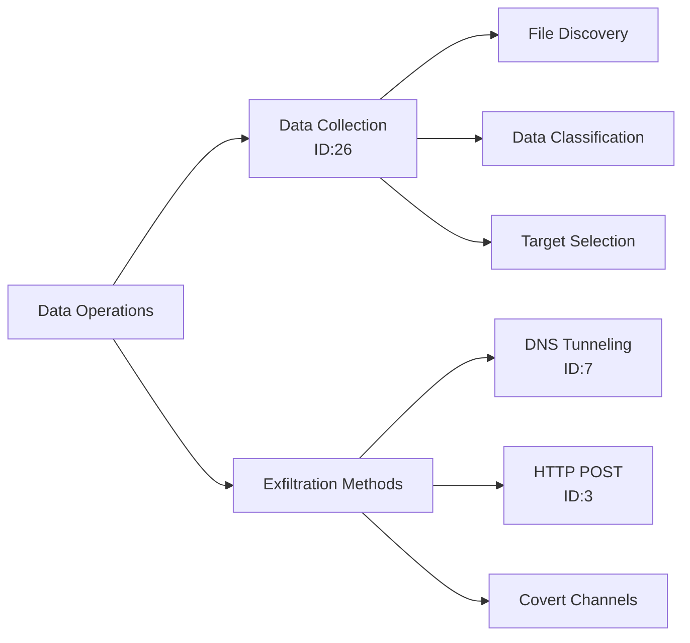

**Data Collection:** Use tools like find (ID 26) to locate valuable data (PDFs, documents, etc.).

**Exfiltration:** Use DNS tunneling (ID 7) or HTTP POST requests (ID 3) to exfiltrate data slowly and stealthily.

### 7. Self-Defense and Adaptation
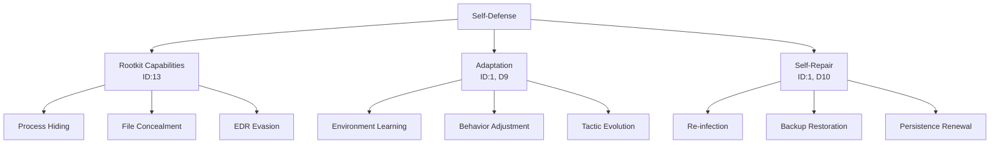

**Rootkit Capabilities:** Hide processes and files (ID 13) to avoid detection by EDR.

**Adaptation:** Learn from the environment (ID 1, D9) and change behavior accordingly.

**Self-Repair:** If detected or removed, the virus can re-infect the system (ID 1, D10).

## Technical Implementation

### Initial Exploit
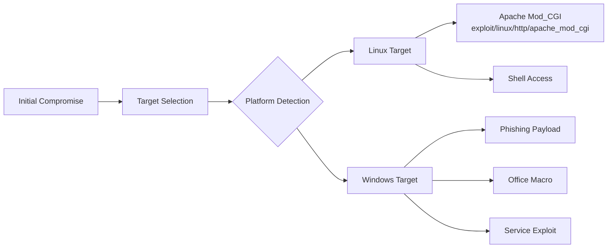

Use the Metasploit module `exploit/linux/http/apache_mod_cgi` (ID 4) to gain a shell.

### Payload
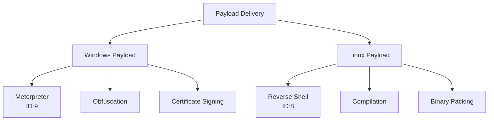

**For Windows:** Use a Meterpreter payload (ID 9) that is obfuscated and signed with a stolen certificate.

**For Linux:** Use a reverse shell (ID 8) that is compiled with obfuscation and packed.

### Persistence Installation
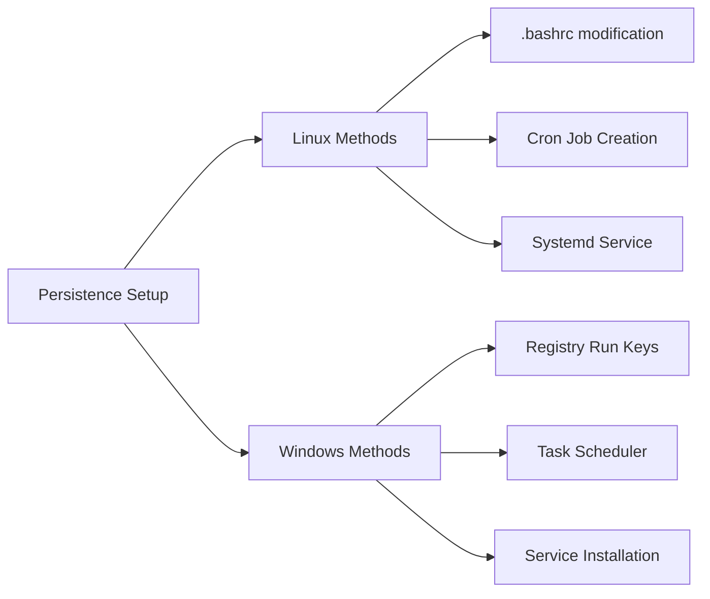

**On Linux:** Add a line to `.bashrc` and create a cron job.

**On Windows:** Modify the Registry Run keys and create a scheduled task.

### Communication
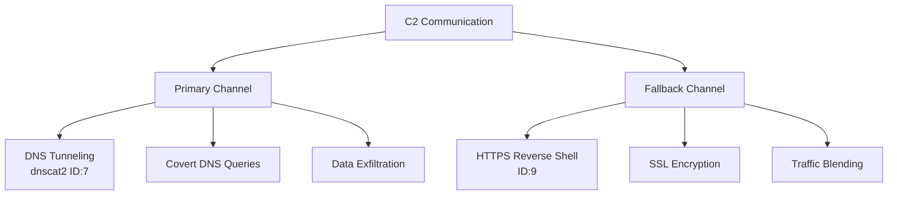

Set up a DNS tunnel using `dnscat2` (ID 7) and a HTTPS reverse shell (ID 9) as a fallback.

### Evasion
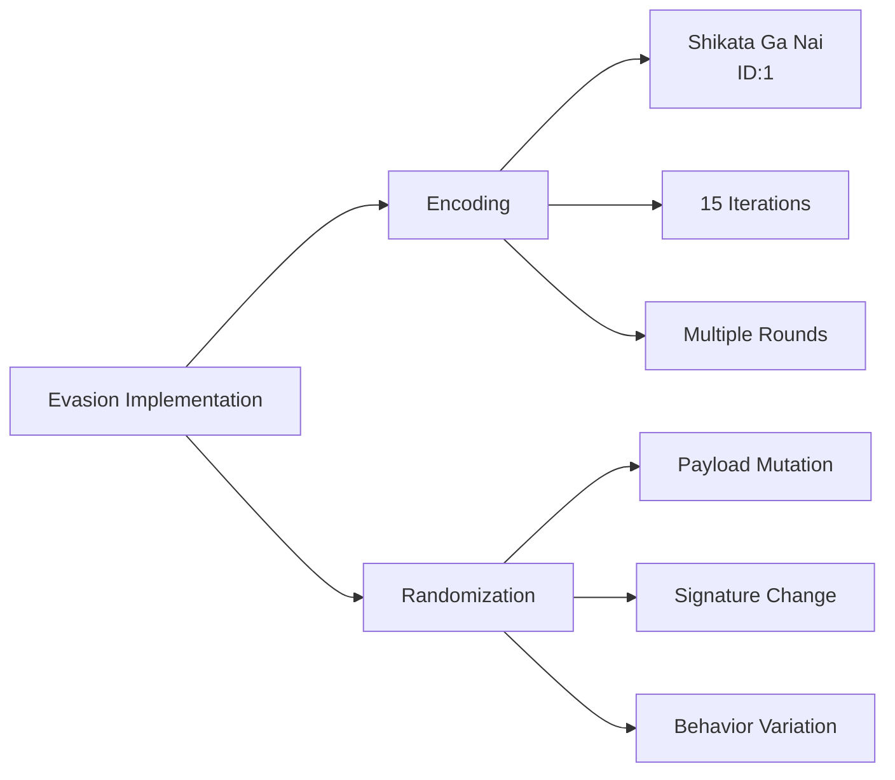

Use the `shikata_ga_nai` encoder (ID 1) with 15 iterations and randomize the payload every time.

### Reconnaissance
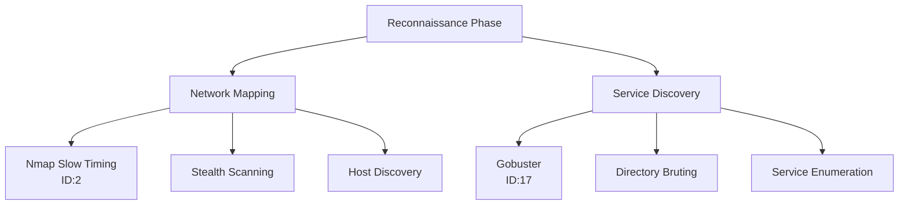

Use `nmap` with slow timing (ID 2) to scan the network and `gobuster` (ID 17) to find web directories.

### Data Exfiltration
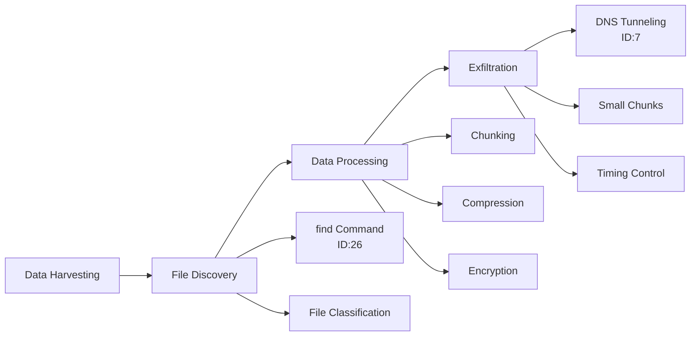

Use `find` (ID 26) to locate PDFs and documents, then exfiltrate via DNS tunneling (ID 7) in small chunks.

## Chatbot Integration

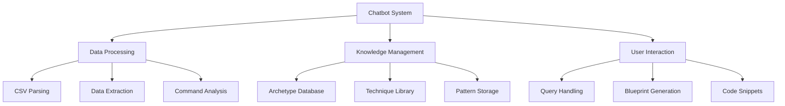

To attach this file to a chatbot and unfold the idea:

### Data Parsing
Parse the CSV data in the file to extract the commands, archetypes, and dimensions.

### Knowledge Base
Use the parsed data as a knowledge base for the chatbot. The chatbot can then answer questions about different archetypes and techniques.

### Virus Design Assistance
The chatbot can assist in designing a virus by suggesting archetypes and techniques based on the user's requirements (e.g., stealth, persistence, etc.).

### Code Generation
The chatbot can generate code snippets for the virus based on the commands in the database.

## Example Chatbot Workflow

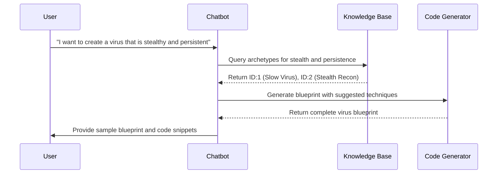

**User:** "I want to create a virus that is stealthy and persistent."

**Chatbot:**
1. Based on the database, it suggests the "Slow Virus" archetype (ID 1) and the "Stealth Recon" archetype (ID 2)
2. It provides the commands and dimensions for these archetypes
3. It can generate a sample virus blueprint (like the one above) and code snippets for the persistence and evasion techniques

## Implementation of Chatbot
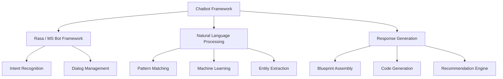

Use a framework like Rasa or Microsoft Bot Framework.

The knowledge base (ICE-Breaker.md) can be parsed and stored in a database or used to train the NLP model.

The chatbot can use pattern matching or machine learning to map user intents to the archetypes and dimensions.

## Conclusion

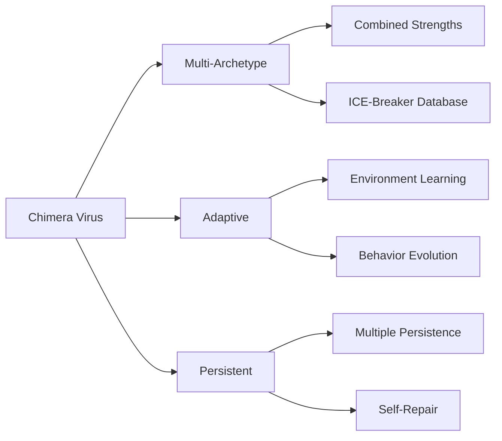

The "Chimera" virus is a theoretical design based on the ICE-Breaker database. It demonstrates how multiple archetypes can be combined to create a powerful and elusive malware. The chatbot integration allows for easy exploration and development of such ideas.