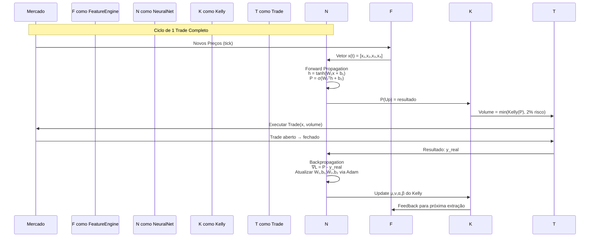

# 🧮 **ARQUITETURA DO PERCEPTRON - PROCESSAMENTO MATEMÁTICO**

## 📊 **FLUXO DE DADOS DO MLP**

```mermaid
flowchart TD
    Start[Preços do Mercado] --> FeatureEngineering
    
    subgraph FeatureEngineering[Engenharia de Features]
        FE1[OHLC Data] --> FE2[FDI Fractal]
        FE1 --> FE3[Dominância Candle]
        FE1 --> FE4[Volatilidade Relativa]
        FE1 --> FE5[Distância EMA]
    end
    
    FeatureEngineering --> InputVector[Vetor de Entrada x = [x₁, x₂, x₃, x₄]]
    
    InputVector --> HiddenLayer[Camada Oculta: 48 neurônios]
    
    subgraph HiddenLayerProcessing[Processamento da Camada Oculta]
        HL1[Multiplicação por W₁] --> HL2[Adição do Bias B₁]
        HL2 --> HL3[Ativação Tanh: hⱼ = tanh(zⱼ)]
    end
    
    HiddenLayerProcessing --> HiddenOutput[Vetor h = [h₁, h₂, ..., h₄₈]]
    
    HiddenOutput --> OutputLayer[Camada de Saída]
    
    subgraph OutputLayerProcessing[Processamento da Saída]
        OL1[Multiplicação por W₂] --> OL2[Adição do Bias B₂]
        OL2 --> OL3[Ativação Sigmoid: σ(z) = 1/(1+e⁻ᶻ)]
    end
    
    OutputLayerProcessing --> Prediction[Predição P(Up) ∈ [0,1]]
```

## 🧠 **MODELO MATEMÁTICO DO MLP**

### **1. VETOR DE ENTRADA (4 DIMENSÕES)**

\[
\mathbf{x} = \begin{bmatrix}
x_1 & x_2 & x_3 & x_4
\end{bmatrix}^T
\]

Onde:
\[
\begin{aligned}
x_1 &= 4.0 \times (\text{FDI} - 1.5) & \text{[FDI normalizado]} \\
x_2 &= \frac{\text{Close} - \text{Open}}{\text{High} - \text{Low}} & \text{[Dominância do candle]} \\
x_3 &= \ln\left(\frac{\text{ATR}_{\text{atual}}}{\text{ATR}_{\text{média 50}}}\right) & \text{[Volatilidade relativa]} \\
x_4 &= \text{clip}\left(\frac{\text{Close} - \text{EMA}}{\text{ATR} \times 5}, -1, 1\right) & \text{[Distância da EMA normalizada]}
\end{aligned}
\]

### **2. CAMADA OCULTA (48 NEURÔNIOS)**

#### **Combinação Linear:**
\[
\mathbf{z}^{(1)} = \mathbf{W}_1 \mathbf{x} + \mathbf{b}_1
\]

Onde:
\[
\mathbf{W}_1 \in \mathbb{R}^{48 \times 4}, \quad \mathbf{b}_1 \in \mathbb{R}^{48}
\]

#### **Ativação Tanh:**
\[
\mathbf{h} = \tanh(\mathbf{z}^{(1)}) = \begin{bmatrix}
\tanh(z_1^{(1)}) \\
\tanh(z_2^{(1)}) \\
\vdots \\
\tanh(z_{48}^{(1)})
\end{bmatrix}
\]

Com:
\[
\tanh(z) = \frac{e^z - e^{-z}}{e^z + e^{-z}}
\]

### **3. CAMADA DE SAÍDA (1 NEURÔNIO)**

#### **Combinação Linear:**
\[
z^{(2)} = \mathbf{W}_2^T \mathbf{h} + b_2
\]

Onde:
\[
\mathbf{W}_2 \in \mathbb{R}^{48}, \quad b_2 \in \mathbb{R}
\]

#### **Ativação Sigmoid:**
\[
P(\text{Up}) = \sigma(z^{(2)}) = \frac{1}{1 + e^{-z^{(2)}}}
\]

## 🔄 **BACKPROPAGATION - APRENDIZADO**

### **1. FUNÇÃO DE PERDA (ERRO QUADRÁTICO)**

\[
L(y, \hat{y}) = \frac{1}{2}(y - \hat{y})^2
\]

Onde:
- \(y\) = target real (0.05, 0.10, 0.90, 0.95)
- \(\hat{y}\) = predição \(P(\text{Up})\)

### **2. GRADIENTES POR CAMADA**

#### **Gradiente na Saída:**
\[
\frac{\partial L}{\partial z^{(2)}} = \hat{y} - y
\]

#### **Gradientes nos Pesos da Camada 2:**
\[
\frac{\partial L}{\partial \mathbf{W}_2} = \frac{\partial L}{\partial z^{(2)}} \cdot \mathbf{h}
\]
\[
\frac{\partial L}{\partial b_2} = \frac{\partial L}{\partial z^{(2)}}
\]

#### **Gradiente na Camada Oculta:**
\[
\delta^{(1)} = \frac{\partial L}{\partial z^{(2)}} \cdot \mathbf{W}_2 \odot (1 - \mathbf{h} \odot \mathbf{h})
\]
Onde \(\odot\) é produto elemento-a-elemento

#### **Gradientes nos Pesos da Camada 1:**
\[
\frac{\partial L}{\partial \mathbf{W}_1} = \delta^{(1)} \mathbf{x}^T
\]
\[
\frac{\partial L}{\partial \mathbf{b}_1} = \delta^{(1)}
\]

### **3. ATUALIZAÇÃO ADAM**

Para cada parâmetro \(\theta\) (pesos e biases):

#### **Primeiro momento (média):**
\[
m_t = \beta_1 m_{t-1} + (1 - \beta_1) g_t
\]

#### **Segundo momento (variância):**
\[
v_t = \beta_2 v_{t-1} + (1 - \beta_2) g_t^2
\]

#### **Correção de bias:**
\[
\hat{m}_t = \frac{m_t}{1 - \beta_1^t}
\]
\[
\hat{v}_t = \frac{v_t}{1 - \beta_2^t}
\]

#### **Atualização:**
\[
\theta_t = \theta_{t-1} - \alpha \frac{\hat{m}_t}{\sqrt{\hat{v}_t} + \epsilon}
\]

Onde:
- \(\alpha = 0.01\) (learning rate)
- \(\beta_1 = 0.9\)
- \(\beta_2 = 0.999\)
- \(\epsilon = 10^{-8}\)

## 📈 **CÓDIGO vs MATEMÁTICA**

```mermaid
graph LR
    subgraph "Código MQL5"
        C1[Feat.GetFeatures] --> C2[Net.Predict]
        C2 --> C3[double prob = ...]
        C3 --> C4[Net.Train]
    end
    
    subgraph "Matemática Correspondente"
        M1[Calcular x₁...x₄] --> M2[Forward Propagation]
        M2 --> M3[P(Up) = σ(W₂ᵀ tanh(W₁x + b₁) + b₂)]
        M3 --> M4[Backpropagation + Adam]
    end
    
    C1 <-.-> M1
    C2 <-.-> M2
    C3 <-.-> M3
    C4 <-.-> M4
```

## 🧮 **DETALHAMENTO DAS FEATURES**

### **1. FDI FRACTAL (x₁)**
```cpp
// Código
double fdi = 1.0 + (MathLog(length) + MathLog(2.0)) / MathLog(2.0 * (double)(InpFDI_Period - 1));
out[0] = (fdi - 1.5) * 4.0;
```

**Matematicamente:**
\[
\text{FDI} = 1 + \frac{\ln(L) + \ln(2)}{\ln[2(N-1)]}
\]
\[
x_1 = 4(\text{FDI} - 1.5)
\]

### **2. DOMINÂNCIA CANDLE (x₂)**
```cpp
// Código
double spread = high[0] - low[0];
out[1] = (close[0] - open[0]) / spread;
```

**Matematicamente:**
\[
x_2 = \frac{C - O}{H - L} \in [-1, 1]
\]

### **3. VOLATILIDADE RELATIVA (x₃)**
```cpp
// Código
out[2] = (avg_atr > 0) ? MathLog(atr[0] / avg_atr) : 0;
```

**Matematicamente:**
\[
x_3 = \ln\left(\frac{\text{ATR}_{\text{now}}}{\frac{1}{50}\sum_{i=0}^{49}\text{ATR}_{-i}}\right)
\]

### **4. DISTÂNCIA EMA (x₄)**
```cpp
// Código
out[3] = (atr[0] > 0) ? (close[0] - ema[0]) / (atr[0] * 5.0) : 0;
if(out[3] > 1.0) out[3] = 1.0;
if(out[3] < -1.0) out[3] = -1.0;
```

**Matematicamente:**
\[
x_4 = \text{clip}\left(\frac{P - \text{EMA}_{200}}{\text{ATR} \times 5}, -1, 1\right)
\]

## 🔄 **PROCESSO COMPLETO DE DECISÃO**

```mermaid
graph TB
    subgraph "FASE 1: Extração de Features"
        F1[Preços OHLC] --> F2[Calcular 4 Features]
        F2 --> F3[Normalização]
        F3 --> X[Vetor x ∈ ℝ⁴]
    end
    
    subgraph "FASE 2: Inferência Neural"
        X --> NN[Rede Neural MLP]
        NN --> P[P(Up) ∈ [0,1]]
    end
    
    subgraph "FASE 3: Filtragem por Regime"
        P --> R1{FDI Regime?}
        R1 -->|Trend: FDI < 1.48| T1[Trend Logic]
        R1 -->|Chaos: FDI > 1.52| T2[Chaos Logic]
        R1 -->|Noise: 1.48≤FDI≤1.52| T3[Bloquear]
        
        T1 --> C1{P(Up) > 0.58?}
        C1 -->|Sim| D1[Dom > 0.3?]
        C1 -->|Não| C2{P(Up) < 0.42?}
        C2 -->|Sim| D2[Dom < -0.3?]
        
        T2 --> C3{P(Up) > 0.65?}
        C3 -->|Sim| D3[DistEMA < -1.8?]
        C3 -->|Não| C4{P(Up) < 0.35?}
        C4 -->|Sim| D4[DistEMA > 1.8?]
    end
    
    subgraph "FASE 4: Execução"
        D1 -->|Sim| E1[Sinal BUY]
        D2 -->|Sim| E2[Sinal SELL]
        D3 -->|Sim| E3[Sinal BUY Chaos]
        D4 -->|Sim| E4[Sinal SELL Chaos]
        
        E1 & E2 & E3 & E4 --> Risk[Calculo de Risco Kelly]
        Risk --> Execute[Executar Trade]
    end
    
    subgraph "FASE 5: Aprendizado"
        Execute --> Close[Trade Fechado]
        Close --> Result[Calcular P&L]
        Result --> Target[Definir Target y]
        Target --> Backprop[Backpropagation]
        Backprop --> Update[Atualizar Pesos W₁,W₂,b₁,b₂]
        Update --> Store[Salvar em CSV]
    end
```

## 📊 **MATRIZES E DIMENSIONALIDADE**

### **Pesos Iniciais (Xavier Initialization):**
\[
W_1^{[i,j]} \sim \mathcal{U}\left(-\sqrt{\frac{6}{n_{in} + n_{out}}}, \sqrt{\frac{6}{n_{in} + n_{out}}}\right)
\]

Onde:
- \(n_{in} = 4\) (entradas)
- \(n_{out} = 48\) (neurônios ocultos)

### **Dimensões:**
\[
\begin{aligned}
\mathbf{x} &: 4 \times 1 \\
\mathbf{W}_1 &: 48 \times 4 \\
\mathbf{b}_1 &: 48 \times 1 \\
\mathbf{h} &: 48 \times 1 \\
\mathbf{W}_2 &: 48 \times 1 \\
b_2 &: 1 \times 1 \\
\hat{y} &: 1 \times 1
\end{aligned}
\]

### **Número de Parâmetros:**
\[
\begin{aligned}
\text{Pesos Camada 1} &: 48 \times 4 = 192 \\
\text{Bias Camada 1} &: 48 \\
\text{Pesos Camada 2} &: 48 \times 1 = 48 \\
\text{Bias Camada 2} &: 1 \\
\text{TOTAL} &: 289 \text{ parâmetros}
\end{aligned}
\]

## ⚡ **EFICIÊNCIA COMPUTACIONAL**

### **Operações por Previsão:**
1. **4×48 multiplicações** = 192 ops
2. **48 adições (bias)** = 48 ops
3. **48 tanh** = ~144 ops (3 ops cada)
4. **48×1 multiplicações** = 48 ops
5. **1 adição (bias)** = 1 op
6. **1 sigmoid** = ~5 ops

**Total:** ~438 operações de ponto flutuante

### **Tempo Estimado:**
\[
t_{\text{pred}} \approx \frac{438 \text{ ops}}{10^9 \text{ ops/s}} \approx 0.438 \mu s
\]
(Assumindo 1 GFLOP/s - na prática ~10-100μs com overhead MQL5)

## 🎯 **INTERPRETAÇÃO DA SAÍDA**

A saída \(P(\text{Up})\) é interpretada como:

\[
\text{Sinal} = 
\begin{cases}
\text{BUY} & \text{se } P(\text{Up}) > \theta_{\text{buy}} \\
\text{SELL} & \text{se } P(\text{Up}) < \theta_{\text{sell}} \\
\text{NEUTRO} & \text{caso contrário}
\end{cases}
\]

Com thresholds adaptativos:
\[
\begin{aligned}
\theta_{\text{buy}}^{\text{trend}} &= 0.58 \\
\theta_{\text{sell}}^{\text{trend}} &= 0.42 \\
\theta_{\text{buy}}^{\text{chaos}} &= 0.65 \\
\theta_{\text{sell}}^{\text{chaos}} &= 0.35
\end{aligned}
\]

## 🔄 **CICLO DE APRENDIZADO REAL-TIME**



Este sistema implementa um **perceptron multicamada adaptativo** que:
1. **Extrai features técnico-matemáticas** do mercado
2. **Processa através de transformações não-lineares** (tanh, sigmoid)
3. **Aprende em tempo real** com backpropagation + Adam
4. **Adapta thresholds** baseado no regime de mercado
5. **Auto-regulariza** via Kelly Bayesiano e limites de risco

---

```mermaid
graph TB
    subgraph "Feature Engineering"
        A1[Preços OHLC] --> A2[Calcular FDI]
        A3[Candle] --> A4[Calcular Dominância]
        A5[ATR] --> A6[Calcular Volatilidade Relativa]
        A7[Close e EMA] --> A8[Calcular Distância Normalizada]
        A2 --> F1[Feature 1: FDI Norm]
        A4 --> F2[Feature 2: Dominância]
        A6 --> F3[Feature 3: Vol Rel Log]
        A8 --> F4[Feature 4: Dist EMA Norm]
    end

    subgraph "MLP - Forward Propagation"
        F1 --> X[Vetor de Entrada x]
        F2 --> X
        F3 --> X
        F4 --> X
        
        X --> H[Camada Oculta: 48 neurônios]
        H --> H1[Ativação Tanh]
        H1 --> Z[Soma Ponderada + Bias]
        Z --> S[Sigmoide]
        S --> P[Probabilidade P(up)]
    end

    subgraph "Decisão"
        P --> D1{Regime e Thresholds}
        D1 -->|Trend + P>58% + Dom>0.3| Buy[BUY]
        D1 -->|Trend + P<42% + Dom<-0.3| Sell[SELL]
        D1 -->|Chaos + P>65% + DistEMA<-1.8| BuyChaos[BUY]
        D1 -->|Chaos + P<35% + DistEMA>1.8| SellChaos[SELL]
        D1 -->|Noise ou sem sinal| NoTrade[Não Operar]
    end

    subgraph "Backpropagation"
        TradeResult[Resultado do Trade] --> Target[Calcular Target y]
        Target --> Error[Calcular Erro: P(up) - y]
        Error --> Grad[Calcular Gradientes]
        Grad --> Adam[Atualizar Pesos com Adam]
        Adam --> Update[MLP Atualizado]
    end

    Buy --> TradeResult
    Sell --> TradeResult
    BuyChaos --> TradeResult
    SellChaos --> TradeResult
```